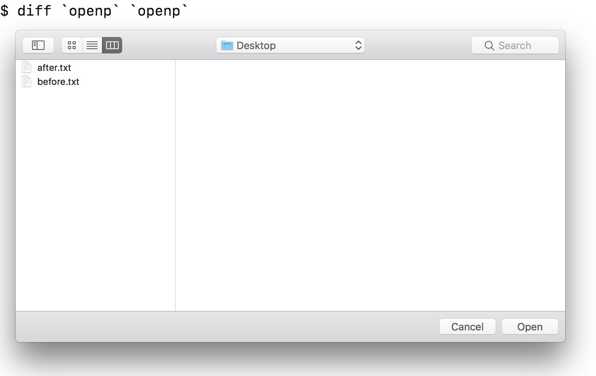

# openp
"openp" just shows open panel GUI to select directory/file, which may fulfills interactive selection in script files.

# Installation

```
$ brew tap watr/formulae
...
$ brew install openp
```

# Usage

```
$ diff `openp` `openp`
```


